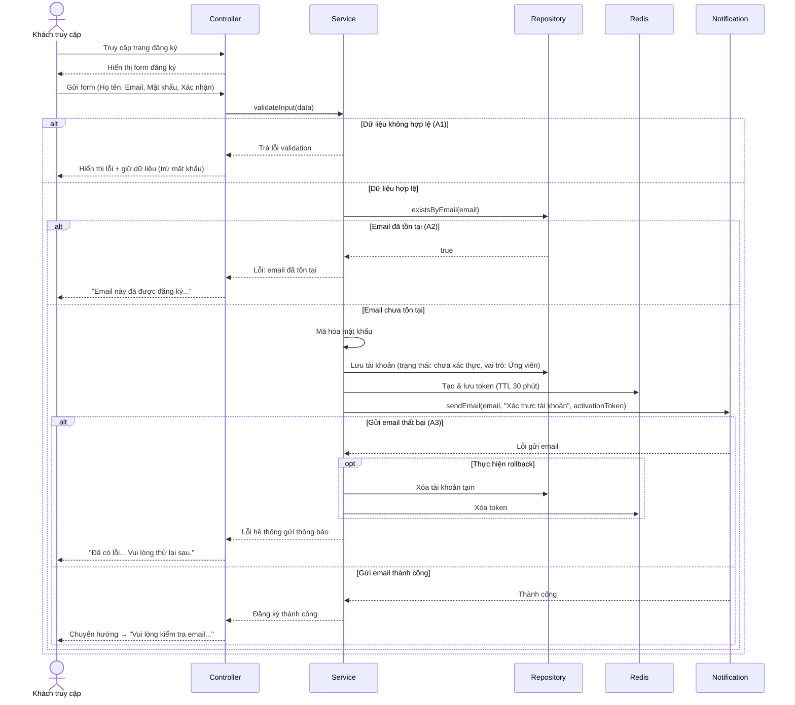
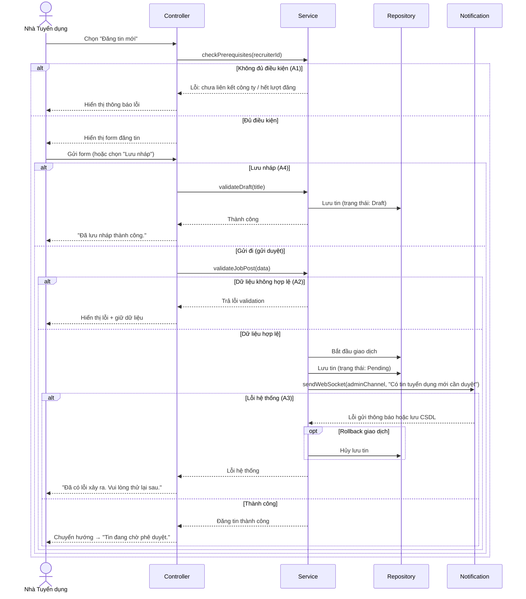
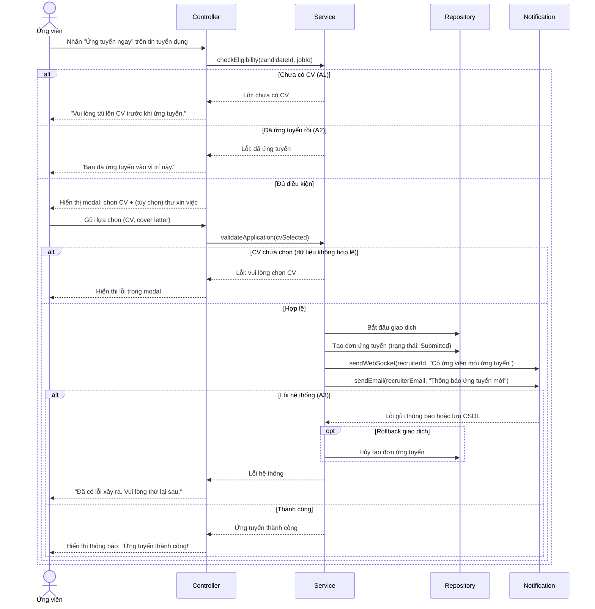
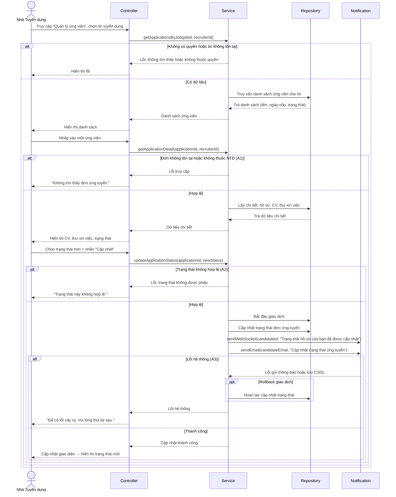
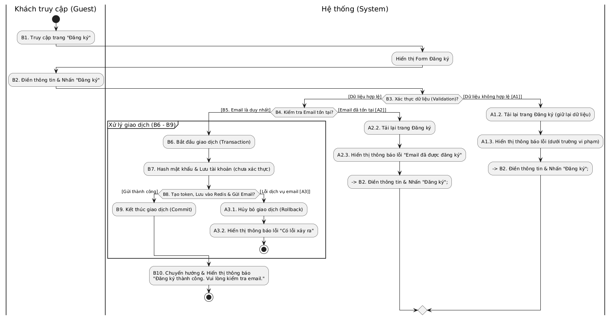
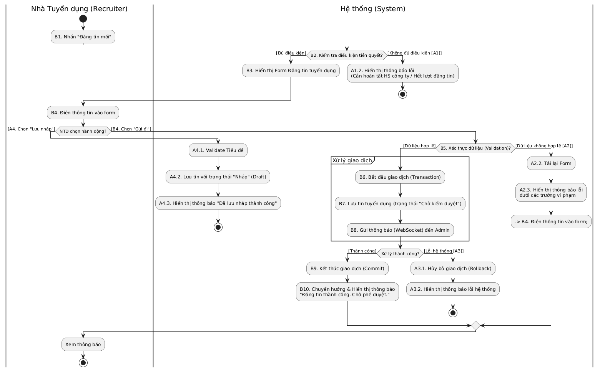
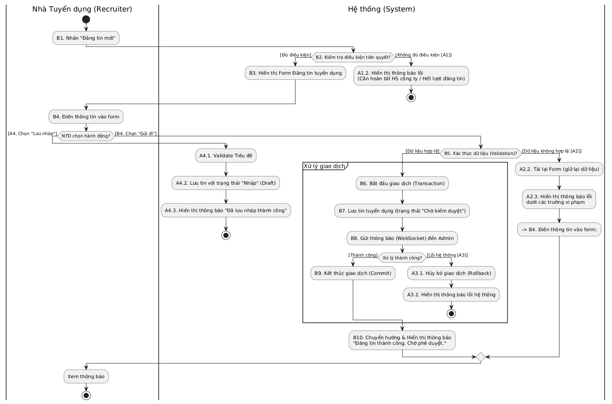
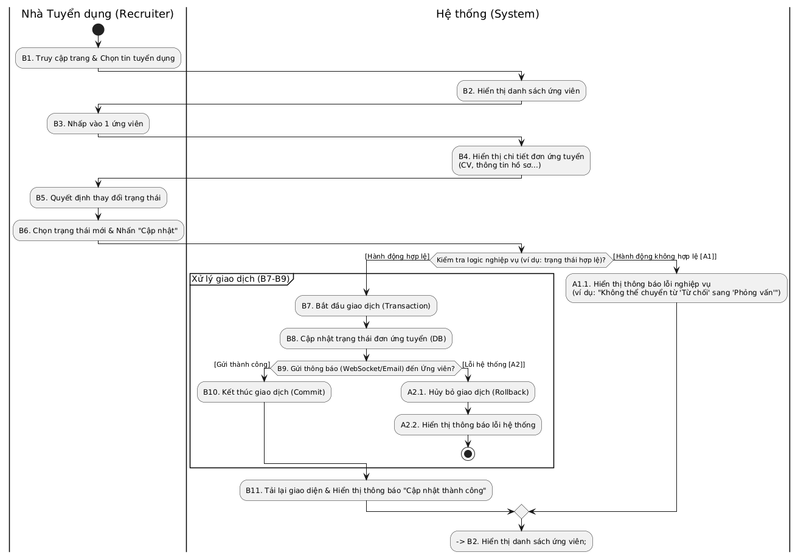

## 1. Biểu đồ tuần tự

### 1.1 Biểu đồ tuần tự chức năng đăng ký

### 1.2. Biểu đồ tuần tự chức năng đăng tin tuyển dụng

### 1.3. Biểu đồ tuần tự chức năng ứng tuyển

### 1.4. Biểu đồ tuần tự chức năng quản lý quy trình ứng tuyển

## 2. Biểu đồ hoạt động

### 2.1. Biểu đồ hoạt động chức năng đăng ký

### 2.2. Biểu đồ hoạt động chức năng đăng tin

### 2.3. Biểu đồ hoạt động chức năng quản lý tin tuyển dụng

### 2.4. Biểu đồ hoạt động chức năng quản lý danh sách ứng viên
