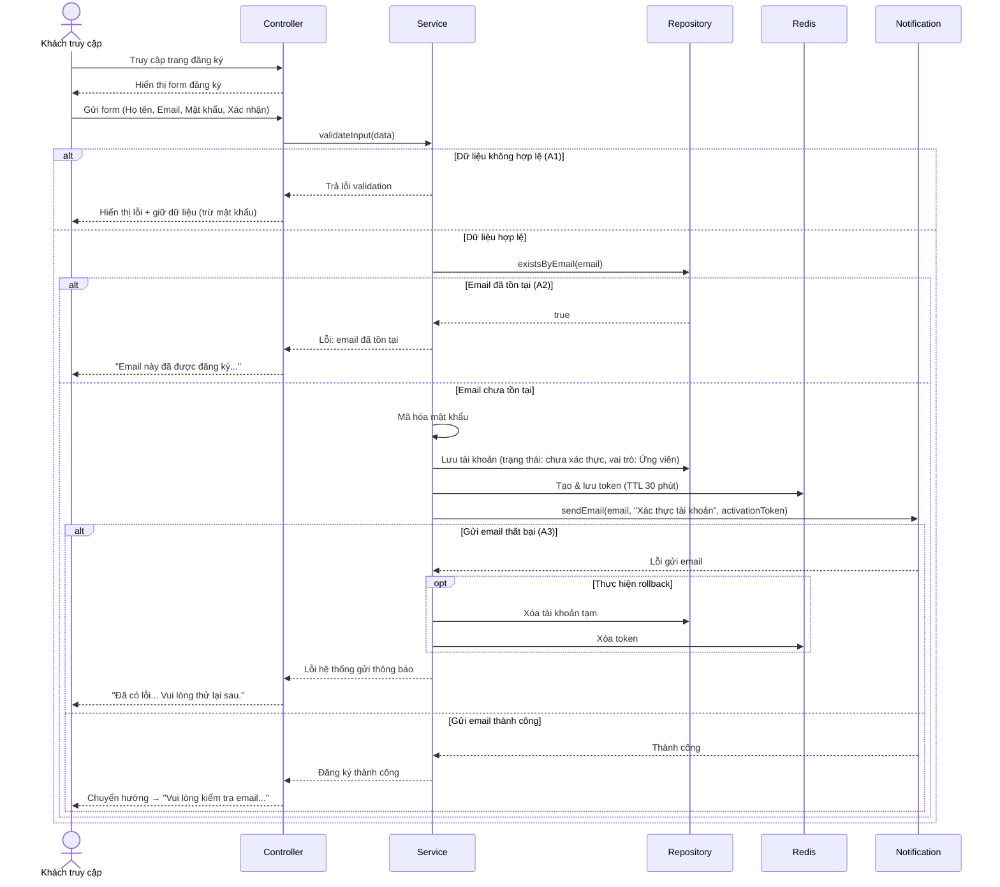

## 1. Biểu đồ tuần tự chức năng đăng ký

```mermaid
sequenceDiagram
    actor Guest as Khách truy cập
    participant Controller
    participant Service
    participant Repository
    participant Redis
    participant Notification

    Guest->>Controller: Truy cập trang đăng ký
    Controller-->>Guest: Hiển thị form đăng ký

    Guest->>Controller: Gửi form (Họ tên, Email, Mật khẩu, Xác nhận)
    Controller->>Service: validateInput(data)

    alt Dữ liệu không hợp lệ (A1)
        Service-->>Controller: Trả lỗi validation
        Controller-->>Guest: Hiển thị lỗi + giữ dữ liệu (trừ mật khẩu)
    else Dữ liệu hợp lệ
        Service->>Repository: existsByEmail(email)

        alt Email đã tồn tại (A2)
            Repository-->>Service: true
            Service-->>Controller: Lỗi: email đã tồn tại
            Controller-->>Guest: "Email này đã được đăng ký..."
        else Email chưa tồn tại
            Service->>Service: Mã hóa mật khẩu
            Service->>Repository: Lưu tài khoản (trạng thái: chưa xác thực, vai trò: Ứng viên)
            Service->>Redis: Tạo & lưu token (TTL 30 phút)

            Service->>Notification: sendEmail(email, "Xác thực tài khoản", activationToken)

            alt Gửi email thất bại (A3)
                Notification-->>Service: Lỗi gửi email
                opt Thực hiện rollback
                    Service->>Repository: Xóa tài khoản tạm
                    Service->>Redis: Xóa token
                end
                Service-->>Controller: Lỗi hệ thống gửi thông báo
                Controller-->>Guest: "Đã có lỗi... Vui lòng thử lại sau."
            else Gửi email thành công
                Notification-->>Service: Thành công
                Service-->>Controller: Đăng ký thành công
                Controller-->>Guest: Chuyển hướng → "Vui lòng kiểm tra email..."
            end
        end
    end
```

## 2. Biểu đồ tuần tự chức năng 